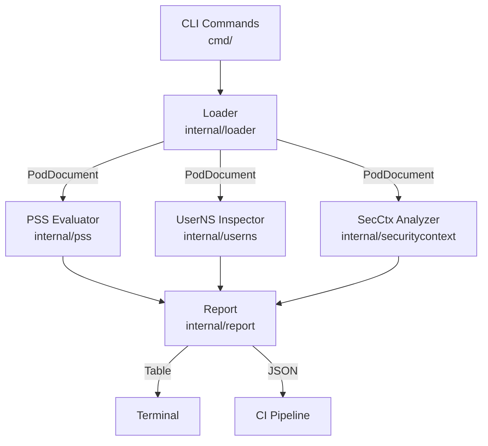

# 🔒 podsentry

**Static Kubernetes Pod security auditor — offline, fast, CI-ready.**

podsentry audits Kubernetes Pod specs against Pod Security Standards, inspects user namespace configuration, and reports security context findings — entirely offline, no cluster required.

[](https://go.dev)
[](LICENSE)
[](https://kubernetes.io/docs/concepts/security/pod-security-standards/)
[](https://github.com/spf13/cobra)

---


<table>
<tr>
<td></td>
<td></td>
</tr>
<tr>
<td></td>
<td></td>
</tr>
</table>

---

## Features

- 🛡️ **Pod Security Standards** — evaluates pods against Privileged, Baseline, and Restricted levels with real upstream rule logic
- 🧑‍💻 **User Namespace Inspection** — reports `hostUsers` configuration and explains UID mapping implications
- 🔬 **Security Context Audit** — checks capabilities, privilege escalation, seccomp profiles, and host namespace usage
- 🗂️ **Directory Scanning** — recursively audit entire manifest repositories in one command
- 📋 **JSON Output** — machine-readable output for CI pipeline integration
- 🎨 **Colored Tables** — human-friendly terminal output with TTY detection
- 🚀 **Exit Code Support** — gate CI builds on security policy compliance
- 📁 **Offline** — no cluster, no admission webhook, no internet required

---

## Commands

| Command | Description | Example |
|---------|-------------|---------|
| `pss <path>` | Check against Pod Security Standards | `podsentry pss pod.yaml --level restricted` |
| `userns <path>` | Inspect user namespace configuration | `podsentry userns pod.yaml` |
| `securitycontext <path>` | Audit security context settings | `podsentry securitycontext pod.yaml` |
| `inspect <path>` | Full combined security report | `podsentry inspect pod.yaml` |
| `version` | Show version information | `podsentry version` |
| `completion` | Generate shell completion | `podsentry completion zsh` |

---

## What are Pod Security Standards?

The [Kubernetes Pod Security Standards](https://kubernetes.io/docs/concepts/security/pod-security-standards/) define three policy levels:

| Level | Description |
|-------|-------------|
| **Privileged** | No restrictions. Allows all pod configurations. |
| **Baseline** | Minimally restrictive. Prevents known privilege escalation. Allows the default pod configuration. |
| **Restricted** | Heavily restricted. Follows security best practices. Requires explicit configuration. |

podsentry implements all rules from the official upstream specification, including checks for privileged containers, host namespaces, HostPath volumes, capabilities, seccomp profiles, and more.

---

## What are User Namespaces?

[User namespaces](https://kubernetes.io/docs/concepts/workloads/pods/user-namespaces/) (controlled by the `hostUsers` field) allow a pod to remap UIDs and GIDs between the container and the host. When `hostUsers: false`, container UID 0 maps to an unprivileged host UID, significantly reducing the impact of container escapes.

podsentry reports whether user namespace isolation is active, detects incompatible configurations (such as privileged containers inside a user namespace), and explains the security implications of each configuration.

---

## Tech Stack

| Component | Library |
|-----------|---------|
| Language | Go 1.22 |
| CLI framework | [cobra](https://github.com/spf13/cobra) |
| Kubernetes types | [k8s.io/api](https://pkg.go.dev/k8s.io/api) |
| YAML parsing | [gopkg.in/yaml.v3](https://pkg.go.dev/gopkg.in/yaml.v3) |
| Table output | [tablewriter](https://github.com/olekukonko/tablewriter) |
| Color output | [fatih/color](https://github.com/fatih/color) |

---

## Architecture



---

## CI Usage

```yaml
# .github/workflows/security.yml
- name: Audit Pod security
  run: |
    go install github.com/alikhere/podsentry@latest
    podsentry pss ./k8s/ --recursive --level restricted --exit-code
```

---

## Prerequisites

- Go 1.22+

## Install & Run Locally

```bash
git clone git@github.com:alikhere/podsentry.git
cd podsentry
go mod tidy
go build -o podsentry ./main.go

# Check a pod against baseline
./podsentry pss examples/noncompliant-pod.yaml

# Check against restricted
./podsentry pss examples/restricted-pod.yaml --level restricted

# User namespace inspection
./podsentry userns examples/userns-enabled-pod.yaml

# Full combined report
./podsentry inspect examples/noncompliant-pod.yaml

# Scan a directory (CI mode)
./podsentry pss examples/ --recursive --exit-code

# JSON output
./podsentry pss examples/baseline-pod.yaml --output json
```

## Example Output

```
FAIL  default/noncompliant-pod  [BASELINE]

  ID          RULE               CONTAINER    SEVERITY  MESSAGE
  PSS-BL-001  Privileged         app          ERROR     privileged mode is not allowed
  PSS-BL-002  Host Namespaces                 ERROR     hostNetwork must not be true
  PSS-BL-002  Host Namespaces                 ERROR     hostPID must not be true
  PSS-BL-004  Host Ports         app          ERROR     host ports are not allowed
  PSS-BL-005  Capabilities       app          ERROR     capability SYS_ADMIN is not in the baseline allowed set
  PSS-BL-005  Capabilities       app          ERROR     capability NET_ADMIN is not in the baseline allowed set

Summary: 1 pods checked, 0 passed, 1 failed, 6 violations
```

---

## Contributing

See [CONTRIBUTING.md](CONTRIBUTING.md) for how to add PSS rules, report formatters, and the branch/commit conventions this project follows.

---

## Roadmap

- [ ] OPA/Rego policy integration
- [ ] Admission webhook mode (in-cluster)
- [ ] SARIF output for GitHub Code Scanning
- [ ] Helm chart values auditing
- [ ] AppArmor and SELinux profile checks
- [ ] Diff mode to compare two manifests

---

## License

MIT — see [LICENSE](LICENSE).
